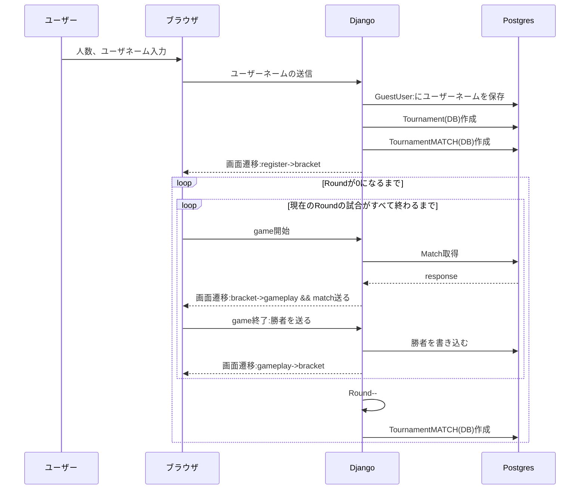

## 必要なこと

1. redisでチャンネルを作る
   - ユーザネームを保存する
1. 試合の組み合わせを作る
1. Gameを開始する
1. Gameの結果を保存する
1. Game結果をもとに次の試合をする
1. Tournamentに描画する



<!-- User: SortedSet
[
    [0, "name0"],
    [1, "name1"],
    [2, "name2"],
]

Winner: SortedSet
[
    [00, "name0"],
    [01, "name0"],
    [00, "name0"],
    [00, "name0"],
    [00, "name0"],
] -->

```
Match: List(queue)
[
    {
        player1: ${user_id},
        player2: ${user_id},
    },
]
```

guest_user

- id
- username

tournament_results

- id
- tournament_id(tournament.id)
- round
- user1(gusest_user.id)
- user2(guest_user_id)
- winner(guest_user_id)

tournament

- id
- partipants_amount
- timestamp
- winner
